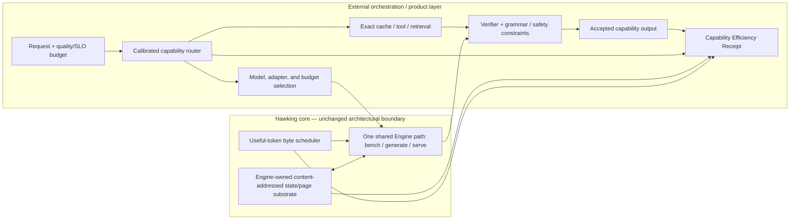

# Beyond FLOPS: a cross-layer research agenda for computational efficiency

**Date:** 2026-07-11 
**Scope:** AI inference algorithms, information theory, compilers, runtimes, operating systems, memory, networks, Apple Silicon, GPUs, and future hardware 
**Local target:** the Hawking Metal-native inference engine

**Evidence policy:** primary papers and official hardware documentation are the evidence base. Peer-reviewed results establish demonstrated mechanisms; vendor results are scoped to the vendor’s evaluated system; recent preprints are frontier signals, not settled facts. Hawking’s own measured kill ledger overrides portable intuition for its current model/hardware path.

## Executive verdict

The central mistake in most inference optimization is treating arithmetic as the product and every other cost as overhead. The product is a correct, useful capability delivered inside a latency, energy, memory, and safety envelope. Arithmetic is only one way to obtain it.

The strongest immediate program is therefore not “a faster matrix multiply.” It is:

1. measure quality-adjusted capability per joule, per byte moved, per touched parameter, and as utility goodput under p95/p99 latency constraints;
2. schedule accepted/useful tokens instead of requests or nominal FLOPs;
3. reuse exact computation and persistent state before recomputing it;
4. turn repetitive generation into retrieval plus exact parallel verification;
5. make KV and recurrent state typed, tiered, compressed, copy-on-write objects;
6. route easy work to rules, retrieval, small models, or specialized devices and escalate only when calibrated uncertainty warrants it.

The strongest medium-term program is to train models for hardware-visible structure: block-sparse conditional depth, indexable attention, finite-state cores with explicit episodic recall, and block-parallel generation. Post-hoc extraction of those properties is much less reliable.

The long-term hardware conclusion is equally direct: a machine that repeatedly moves a model from memory to arithmetic units once per token is architecturally backwards. The efficient end state is compressed parameters held stationary beside compute, activation/events moving through the model, and memory banks performing selection, reduction, and state update locally.

None of the numerical reduction ranges below are promises. Published results are explicitly attributed. All other ranges are **research targets to falsify under fixed-quality gates**. They are not additive.

## 1. Why matrix multiplication became dominant—and why that is not a law

Dense affine maps won because they form a particularly convenient bargain:

- they are differentiable and expressive;
- they batch and parallelize cleanly during training;
- they map to regular arrays with predictable memory access;
- libraries and accelerators made them cheap, which encouraged architectures to contain more of them;
- parameter count, FLOPs, and scaling laws were easy to measure, which made dense compute easy to fund and compare.

This is path dependence and hardware/model co-evolution. During batch-1 autoregressive decode, much of the nominal “matrix multiplication” is physically a matrix-vector stream: each token rereads a large weight set to produce one small vector. Apple’s own M4-to-M5 measurements show subsequent-token speed tracking the 28% memory-bandwidth increase (19–27% generation gain), while compute-bound first-token latency benefits far more from new matrix hardware. That is direct evidence that peak arithmetic and decode speed are different quantities ([Apple ML Research](https://machinelearning.apple.com/research/exploring-llms-mlx-m5)).

FLOPS survived as the primary measurement because floating-point arithmetic was a portable, countable HPC abstraction and peak rates were easy for hardware vendors to publish. The count assumes operations are interchangeable and ignores operands’ origin, reuse, precision, control value, and whether the result changes the accepted output. A lookup-based ternary update, an FP16 multiply, a rejected draft token, and an all-reduce cannot be ranked honestly by converting them to nominal FLOPs.

The right lower bound for a request is closer to:

\[
T \;\ge\; \max\left(
\frac{N_{op}}{R_{op}},
\frac{B_{dram}}{BW_{dram}},
\frac{B_{ssd}}{BW_{ssd}},
\frac{B_{net}}{BW_{net}},
T_{dependency},
T_{sync},
T_{queue}
\right)
\]

and total energy is closer to:

\[
E \approx \sum_h e_h B_h + \sum_o e_o N_o + E_{idle},
\]

where `h` ranges over register, SRAM/cache, DRAM, package link, network, and storage traffic. The classic Roofline model already binds performance by operational intensity, not peak FLOPS alone ([Williams, Waterman, Patterson](https://escholarship.org/uc/item/5tz795vq)). FlashAttention is the AI-era demonstration: it preserves exact attention semantics while changing tiling and memory traffic, yielding wall-clock gains that an operation count misses ([FlashAttention](https://arxiv.org/abs/2205.14135)). Horowitz’s energy analysis and Eyeriss both show why distance of movement matters as much as operation count ([Horowitz](https://doi.org/10.1109/ISSCC.2014.6757323), [Eyeriss](https://doi.org/10.1109/JSSC.2016.2616357)). Exact values change with process technology; the hierarchy does not disappear.

### Laws versus conventions

| Category | Statement | Consequence |
|---|---|---|
| Law/constraint | Autoregressive commitment creates a dependency chain between accepted tokens. | Reduce expensive rounds per accepted token, or change the generation formulation. |
| Law/constraint | Generic exact online attention cannot have truly sublinear state or guaranteed sublinear non-adaptive time without assumptions. For `d = Ω(log n)`, the 2025 lower bound is `Θ(nd)` space. | Sublinear attention must exploit trained structure/sparsity, accept bounded approximation, or change architecture ([Haris & Onak](https://proceedings.mlr.press/v291/haris25a.html)). |
| Law/constraint | Information lost by compression cannot be recovered without side information, a model prior, or recomputation. | Every approximate path needs an explicit distortion/quality budget and fallback. |
| Law/constraint | Communication has distance, topology, serialization, and synchronization costs. | Moving compute to state can dominate moving state to nominally faster compute. |
| Convention | Every token receives every layer, head, neuron, and precision. | Train compute allocation as a model output. |
| Convention | The tensor/operator is the runtime scheduling unit. | Make state objects, useful tokens, pages, events, and dependency DAGs first-class. |
| Convention | A request begins as text and ends when generation pauses. | Treat inference as a resumable process with persistent versioned state. |
| Convention | One large model should answer every input. | Optimize expected utility with cascades, retrieval, tools, and specialized models. |
| Convention | Floating-point operations are comparable work. | Bit lookup, routing, decompression, search, communication, and rejected work expose the fiction. |
| Convention | Parameter count measures deployed capability. | Distinguish stored, resident, activated, touched, and transferred parameter bytes. |

## 2. A replacement measurement system

For a fixed held-out workload distribution `𝒟` with `N` requests, let `u_j` be request utility: quality-weighted task success with safety and correctness constraints, not token count. A system should publish a **Capability Efficiency Record** as a Pareto vector rather than collapse everything into one gameable score:

\[
\eta = \left(
\frac{\sum_j u_j}{\sum_j E_j},
\frac{\sum_j u_j}{\sum_{j,h} \alpha_h B_{j,h}},
\frac{N^{-1}\sum_j u_j}{P_{stored}},
\frac{\sum_j u_j}{\sum_{j,t} P_{touched}(j,t)},
\frac{\sum_j u_j}{T_{wall}},
\frac{\sum_j u_j}{\sum_j S_j}
\right), \quad Q \ge Q_0-\epsilon.
\]

`α_h` weights bytes by hierarchy distance or measured energy. `S_j` is the request’s amortized share of persistent cache/index/storage byte-seconds. Mean utility per stored parameter is conventional capability density; utility per touched-parameter event exposes conditional execution and repeated passes; the storage charge prevents retrieval systems from pretending that an external corpus is free. `Σu/T_wall` is utility goodput. p50/p95/p99 latency are SLO constraints and distributions, not denominators that grow merely because more requests were run. Publish confidence intervals and worst-slice quality, not only the mean. The raw counters should remain available so readers can choose different weights.

Lifecycle costs must also be amortized rather than hidden:

\[
E_{effective/request}=E_{inference}
+\frac{E_{train}}{N_{lifetime}}
+\frac{E_{index}}{N_{queries}}
+\frac{E_{compile}+E_{autotune}}{N_{invocations}}
+\frac{E_{replication}}{N_{queries}}.
\]

Hardware comparisons should include idle and cooling power and either include embodied/manufacturing energy or explicitly declare it out of scope. Training or co-training-heavy proposals M3/M4/M6/M7/M8/L1/L4 must report the lifetime-query break-even point against software-only alternatives.

Every benchmark receipt should contain:

- task-suite and prompt hashes, model/tokenizer/adapter revision, context and output geometry;
- quality, safety, calibration error, and exact-distribution status where applicable;
- p50/p95/p99 TTFT, inter-token latency, completion latency, and SLO goodput;
- wall energy including idle, CPU, GPU/NPU, storage, NIC, drafts, rejected branches, and decompression;
- bytes read/written at each memory and network tier;
- stored, resident, activated, and touched parameter bytes;
- useful accepted tokens per full target-weight read;
- cache hit, state reuse, speculative acceptance, routing/escalation, and recomputation-avoidance rates.

MLPerf already combines accuracy gates, latency/throughput scenarios, and wall power, but its client LLM score still centers TTFT and tokens/s. This proposal extends that foundation from model execution to useful end-to-end work ([MLPerf Client](https://mlcommons.org/benchmarks/client/), [MLPerf Inference Power](https://mlcommons.org/benchmarks/inference-datacenter/)).

### Information-theoretic interpretation

Each compressed representation should be treated as a rate-distortion decision, not a datatype choice:

\[
\min_{representation,\ policy} \; R_{bits}+\lambda E+\mu T
\quad \text{subject to} \quad D_{task}\le\epsilon.
\]

`D_task` is end-to-end task distortion, including calibration, safety, recall, output-length changes, and accumulated state error. Tensor MSE is only a proxy. This is why a numerically plausible random-input int4 KV test can still fail real generation.

For an optional execution step `i`, define its marginal value as the expected reduction in uncertainty or task loss divided by its physical cost:

\[
V_i = \frac{\mathbb{E}[\Delta U_i]}{E_i+\lambda_B B_i+\lambda_T T_i}.
\]

Conditional depth, retrieval, precision promotion, speculation, and escalation can use calibrated `V_i` as a scheduling feature. Greedily taking the largest value is not generally optimal under dependencies, deadlines, budgets, and future option value; the full problem is a constrained sequential decision process. Logit entropy alone is not `ΔU`; it must be calibrated against task outcomes. Exact speculative verification is especially powerful because a cheap draft supplies side information while the target computes proposed-position logits in parallel and uses them for acceptance/correction under the target distribution. Persistent caching exploits mutual information across requests rather than making each request pay as if it were independent.

## 3. Costs that consume time without proportional information

| Cost | Why it can be low-information | Remedy |
|---|---|---|
| Rereading all weights for punctuation, boilerplate, or highly predictable tokens | Target entropy can be low while bytes/token remain constant. | Retrieval/draft plus parallel verification; adaptive depth; smaller-tier routing. |
| Recomputing identical system prompts, documents, or agent branches | Deterministic work is repeated because the API forgets state. | Content-addressed prefix/state DAG. |
| Reading every KV position for every query | Relevance is often sparse, but not universally; Hawking’s Qwen trace is notably diffuse. | Query-indexed pages only where measured or trained; recurrent/episodic hybrid otherwise. |
| Full precision everywhere | Error sensitivity varies by tensor, layer, state age, and token difficulty. | Rate-distortion allocation with real-input quality gates. |
| Materializing/transposing intermediates | Layout contracts, not semantics, force round trips. | Data-movement IR and cross-operator layout search. |
| Rejected speculative branches | Work was performed but no accepted capability was delivered. | Acceptance/cost governor; cancel losers; count rejected joules. |
| Moving or recomputing paused agent state | Synchronous request semantics discard useful work during tool/human waits. | Inference-process checkpoint, memory lease, and resume. |
| All-reduce/all-to-all at every layer | Communication repeats even when state/expert locality is predictable. | Token/state placement, fused semantic collectives, local experts. |
| Sparse gathers and routing metadata | Fewer arithmetic operations can create more random bytes and synchronization. | Hardware-visible blocks and static-capacity routing. |
| Dequantize/requantize cycles | Representation conversion exists only because compute cannot consume the stored code directly. | Direct low-bit/LUT execution and codec-aware hardware. |

## 4. Proposal portfolio

### Immediate implementation — enabling systems

These seven items are not claimed as wholly new mechanisms; most have strong prior art. Their role is to replace the execution substrate and measurement boundary so later paradigm research can produce a real system win rather than an isolated paper result.

#### I1. Capability Efficiency Ledger

Add a quality-gated, per-request accounting plane to Hawking. It attributes time, energy, bytes, touched parameters, cache reuse, and discarded work to prefill, decode, attention, experts, speculation, retrieval, and I/O. It is a prerequisite because an optimization that shifts work from GPU arithmetic to CPU, SSD, network, or longer outputs can otherwise look free.

The ledger does not itself save bytes. Its target overhead is under 2% and it should run in sampled production mode. It changes the optimization objective and supplies the online features for later schedulers.

#### I2. Useful-token, byte-budgeted locality scheduler

Schedule a bounded number of useful decode, prefill, verification, and retrieval tokens per iteration. Protect decode deadlines; fill remaining capacity with bounded prefill chunks; prefer requests that share weights, prefixes, experts, cache pages, and compiled graph shapes. Dense weight bytes per sequence-token can ideally move from `Θ(W)` toward `Θ(W/B)` for batch `B`, where `W` is the target weight stream per pass.

This is supported by iteration scheduling, chunked prefill, and prompt-aware routing: Sarathi-Serve reports 2.6–5.6× serving-capacity gains in its evaluated systems, while Preble reports large average and tail-latency reductions on prefix-heavy distributed workloads ([Sarathi-Serve](https://www.usenix.org/conference/osdi24/presentation/agrawal), [Preble](https://proceedings.iclr.cc/paper_files/paper/2025/hash/5bc342f48de8264779952fac378f96dc-Abstract-Conference.html)). Those are workload/system results, not Hawking forecasts.

#### I3. Content-addressed persistent state plane

Make full-prefix KV, recurrent state, compiled prompt modules, grammar state, and speculative branches immutable versioned objects. Causal state identity must cover the entire token prefix or a cryptographic parent-state chain—not merely the local page/module content—and include state-type schema, model, tokenizer, adapter, positional scheme, runtime/numerical ABI, layout, and precision. Grammar definition and sampler/RNG identity join the key when they affect the cached state or continuation. Use copy-on-write branches and schedule a request where its state already resides.

Prompt Cache reports 8× GPU and 60× CPU TTFT improvements on reusable prompt modules; the complete SGLang system reports up to 6.4× application throughput across its evaluated workloads—this is not an isolated RadixAttention speedup; Hydragen reports up to 32× on large batches with long shared prefixes ([Prompt Cache](https://arxiv.org/abs/2311.04934), [SGLang](https://arxiv.org/abs/2312.07104), [Hydragen](https://arxiv.org/abs/2402.05099)). Identical-position prefix hits can be exact; Prompt Cache’s modular composition changes attention masking and is an approximation with its own quality contract. All forms remain workload-dependent. Privacy, tenant isolation, invalidation, and encrypted-at-rest state are part of the design, not follow-ups. Default to tenant-keyed identities and no cross-tenant deduplication: equality and timing of a global content hash can leak shared prompt content.

#### I4. Retrieval-first, exact-verified execution

Before drafting with another neural model, try n-gram/suffix retrieval and cached continuations with a known proposal distribution. Verify a candidate block or tree with the target in one dense pass; an appropriate rejection-sampling protocol can preserve the target distribution. Constrained grammar decoding instead preserves a **grammar-conditioned** target, and deterministic tools/cached answers bypass generation under their own correctness contract; neither should be labeled equivalent to the unconstrained model. If `A` tokens are accepted per target pass, target weight traffic per accepted token approaches `W/A` rather than `W`.

REST reports 1.62–2.36× on code/text generation and conventional speculative sampling reports 2–2.5× in its distributed setup ([REST](https://arxiv.org/abs/2311.08252), [speculative sampling](https://arxiv.org/abs/2302.01318)). Hawking’s trained EAGLE and existing speculative path were net-negative in local tests, so this proposal is admissible only behind a live acceptance/energy governor; it is not a recommendation to re-enable speculation by default.

#### I5. Information-tiered KV, recurrent memory, and dynamic precision

Treat state as a database, not one homogeneous tensor: lossless/reference f32 recent pages, numerically lossy but all-position per-channel quantized warm pages, and lossless SSD backing. A bounded recurrent cold summary is an explicitly lossy mode with a lossless-page fallback, never a silent replacement. It exists only if a recurrent engine processed the history concurrently or a trained bridge/model produced the state; transformer KV cannot simply be reinterpreted as RWKV/Mamba state. Copy-on-write pages make speculative rollback cheap. Precision is promoted when calibrated error/recall risk exceeds budget by fetching lossless backing or recomputing; widening a stored int4 value cannot restore discarded information. Per-token weight-format switching is not assumed to help: retaining multiple layouts or fragmenting batches can move more bytes than it saves. Query-selected eviction is **not** part of the immediate Hawking path; it belongs to trained/independently gated M4.

KIVI reports 2-bit KV with 2.6× lower total peak memory and 2.35–3.47× throughput; CacheGen reports 3.5–4.3× smaller transferred KV and 3.2–3.7× lower context loading delay ([KIVI](https://proceedings.mlr.press/v235/liu24bz.html), [CacheGen](https://arxiv.org/abs/2310.07240)). DeepSeek-V2’s trained MLA reports a 93.3% KV reduction ([DeepSeek-V2](https://arxiv.org/abs/2405.04434)). Hawking’s broad Qwen attention distribution forbids assuming that eviction is safe; the immediate path is precision/tiering with all-position addressability and lossless fallback, with learned selection deferred to M4.

#### I6. Calibrated capability cascade and heterogeneous runtime

Route a request through the cheapest mechanism likely to meet its quality target: deterministic tool or cache, lexical/vector retrieval, small local model, recurrent model, then large model. Optimize expected cost

\[
E[C] = C_{router}+\sum_{i=1}^{K}Pr(reach\ tier\ i)C_i,
\]

including retries, and expose abstention. Use CPU/ANE for small static routers or drafts only when measured; use the GPU for the quantized target. On Apple hardware ANE execution is mediated through Core ML, with operator/shape/conversion/scheduling/observability limits; Hawking cannot send arbitrary Metal kernels to it. Unified memory removes copies on Apple Silicon, not shared-bus contention. FrugalGPT and later cascade work show that large expected-cost reductions are possible on selected workloads ([FrugalGPT](https://arxiv.org/abs/2305.05176), [online cascade learning](https://proceedings.mlr.press/v235/nie24a.html), [unified routing/cascading](https://proceedings.mlr.press/v267/dekoninck25a.html)). For Hawking, the first implementation should be an outer orchestration/service layer that invokes the unchanged `Engine`; moving routing/tools into the core would revise the three-layer architecture and same-Engine invariant and is a high-difficulty product decision.

#### I7. Flash/expert-paged capacity execution

Do not require immutable weights to be fully DRAM-resident. Keep hot rows/experts in memory, issue large contiguous flash reads, and overlap them with independent work. For dense models this is primarily a capacity/batch-processing regime; for MoE or trained structured sparsity, bytes can scale with the active fraction rather than total stored parameters. Predictive expert prefetch is conditional on a per-target oracle showing routing entropy/stability and enough lead time to hide the read; without that evidence, paging begins only after the actual gate result and the serialized storage latency is charged in full.

Apple’s “LLM in a Flash” reports 4–5× CPU and 20–25× GPU gains over naive flash loading and models up to twice available DRAM ([Apple ML Research](https://machinelearning.apple.com/research/efficient-large-language)). Those are comparisons to naive offload, not to a resident model. Hawking already has `press`/Condense, mmap, and planned expert paging, so the immediate question is useful capability at an honest page-fault/energy SLO—not a resident-decode TPS claim.

### Medium-term research

#### M1. Stateful inference OS and process ABI

Turn an inference into a resumable process with a state handle, priority, memory lease, deadline, RNG/sampler state, draft state, checkpoint, fork, migration, and interrupt/resume semantics. Agent tool calls and human pauses no longer terminate the computation. External effects require an effect barrier, durable outbox/effect log, and idempotency key covering the checkpoint and tool invocation. With a cooperative idempotent endpoint this can provide effectively exactly-once execution; otherwise each adapter must declare at-most-once/no-retry or at-least-once/retry semantics rather than imply impossible transparent exactly-once behavior. An admission controller should reject or defer work before expensive prefill if downstream decode capacity cannot satisfy the SLO.

Llumnix demonstrates the value of request-state migration under skew, reporting an order-of-magnitude tail-latency improvement and up to 36% cost savings; INFERCEPT shows that preserving or selectively swapping intercepted state avoids substantial agent recomputation ([Llumnix](https://arxiv.org/abs/2406.03243), [INFERCEPT](https://arxiv.org/abs/2402.01869)). Migration can increase bytes, so the OS must choose among preserve, compressed transfer, recompute, and discard.

#### M2. Byte-minimizing compiler IR and safe self-tuning

Create an IR in which layout, lifetime, memory tier, quantization code, page format, sharding, collective, quality distortion, and state identity are first-class. Jointly search algebra, packing, tiling, vertical fusion, and placement. Equivalent transformations require deterministic or probabilistic equivalence checks plus end-to-end quality gates.

WELDER reports 52% fewer global transactions in an ablation and 1.47× average performance over TensorRT; Mirage combines algebraic and scheduling search and reports 1.1–2.9× over existing systems ([WELDER](https://www.usenix.org/system/files/osdi23-shi.pdf), [Mirage](https://arxiv.org/abs/2405.05751)). Hawking has already shown that trivial fusion and host dispatch elimination are below the useful threshold; this compiler must target actual global bytes, layouts, codecs, and collectives rather than dispatch count.

#### M3. Train structured conditional computation

Train each token to emit a bounded depth/head/block budget. Use static-capacity top-k routing so the chosen identities are dynamic but tensor sizes remain hardware-friendly. Skip whole quantized blocks, not scattered neurons, and batch requests with compatible routes.

Mixture-of-Depths reports sampling steps over 50% faster, CALM reports a potential 3× adaptive-depth speedup, and structured activation work shows that sparsity can accelerate only when the representation and kernels match it ([Mixture-of-Depths](https://arxiv.org/abs/2404.02258), [CALM](https://arxiv.org/abs/2207.07061), [ProSparse](https://arxiv.org/abs/2402.13516)). This is deliberately a training proposal: Hawking’s post-hoc FFN block-sparsity oracle found essentially no skippable 256-wide blocks at a 99% recall gate.

#### M4. Train indexable attention with a finite-state core and episodic recall

Use recurrent/linear state and a small exact local window by default. Train a query/index representation that invokes block-sparse exact attention or retrieval for episodic facts the finite state cannot reliably retain. The model learns when to recall; the runtime stores indexable pages.

Mamba-2 reports a 2–8× faster core than Mamba, RWKV-7 offers constant memory/time per token, Native Sparse Attention trains hierarchical hardware-aligned selection, and Kimi Linear reports up to 75% less KV with up to 6× decoding throughput at 1M context ([Mamba-2](https://arxiv.org/abs/2405.21060), [RWKV-7](https://arxiv.org/abs/2503.14456), [NSA](https://arxiv.org/abs/2502.11089), [Kimi Linear](https://arxiv.org/abs/2510.26692)). Haris–Onak establishes the barrier for generic exact attention, not recurrent models. The separate capacity argument is that a fixed-dimensional, finite-precision recurrent state cannot preserve an unbounded set of arbitrary exact dependencies; explicit episodic storage supplies the missing growing information capacity.

#### M5. Communication-avoiding distributed execution

Keep weights, experts, and state stationary; move small token/query vectors to them. Route requests by prefix and expert signature, replicate hot state/experts, stream compressed KV only when phase disaggregation wins, and fuse compute with collectives so arrivals are consumed tile by tile. Model every route with `T_net≈α·messages+β·bytes+T_congestion+T_straggler`; moving a query through more stationary shards can add serial hops even while reducing bytes. A progressive semantic RPC can send low-bit sufficient statistics first and residuals on demand, with in-network reduction or coded redundancy where the topology supports it. Phase-specific prefill/decode pools are a policy choice, not a universal architecture.

DistServe reports up to 7.4× more SLO-compliant requests by separating phases; Mooncake reports 75% more requests on its real trace with a KV-centric state fabric; FLUX reports up to 1.66× prefill and 1.30× decode by fusing communication and computation ([DistServe](https://www.usenix.org/conference/osdi24/presentation/zhong-yinmin), [Mooncake](https://www.usenix.org/conference/fast25/presentation/qin), [FLUX](https://arxiv.org/abs/2406.06858)). On one Apple SoC, prefill/decode disaggregation is usually unattractive because devices share the same memory/power envelope; state locality remains valuable.

#### M6. Block-parallel and asynchronous generation

Replace one-token commitment rounds with a block of `b` provisional tokens refined for `s` dense passes, then commit. The ideal number of model-weight rounds becomes `s⌈T/b⌉` rather than `T`; useful acceleration requires `s < b`. Diffusion, Jacobi refinement, multi-token prediction, and dynamically verified trees are instances of the broader idea.

Early block-diffusion work makes arbitrary-length/KV-cached generation possible, and recent preprints report roughly 2.5× on selected tasks, but total arithmetic can rise and strongly sequential reasoning can regress ([Block Diffusion](https://arxiv.org/abs/2503.09573), [Fast-dLLM v2](https://arxiv.org/abs/2509.26328)). Asynchronous provisional output can reduce perceived latency, but it should count corrections and discarded work; otherwise it merely hides higher energy use.

#### M7. Predictive innovation coding with successive refinement

Train activations, KV/recurrent state, and distributed messages to minimize **conditional** code length given the prior state, a neighboring layer, a shared prefix, or a speculative draft. Store/transmit a cheap base description or sufficient statistic first; request residual refinement only when a calibrated decoder or verifier cannot meet the task-distortion budget. The primitive is “send the innovation,” not “quantize the whole tensor again.”

In the ideal lossy source-coding view, expected payload is governed by the conditional rate-distortion function `R_{X|C}(D_task)`, not merely the marginal code length of `X`; conditional entropy `H(X|C)` is the lossless special case. That notation assumes side information `C` is available to both encoder and decoder—as it can be for a shared accepted prefix, replicated prior state, or an explicitly transmitted base layer. If context exists only at the receiver, distributed lossy messages instead need a Wyner–Ziv-style bound; the lossless correlated-source analogue is Slepian–Wolf. The implementation must label which side information is shared, receiver-only, or itself charged as payload. Successive layers are efficient only when the source/distortion pair is approximately successively refinable—otherwise progressive coding can cost more than a one-shot code. Practical work is further bounded by entropy-model, random-access, metadata, and decoder costs. CacheGen establishes that distribution-aware KV bitstreams can reduce transfer, but this proposal extends the idea across layers, time, requests, and network RPCs with an exact/full-precision fallback ([CacheGen](https://arxiv.org/abs/2310.07240)). It is a new cross-layer hypothesis, not a current Hawking speed claim.

#### M8. Trained multi-fidelity neural solver

Borrow a posteriori error control from numerical methods. A cheap coarse operator predicts a block/layer update; a learned residual **risk estimator** either accepts it, applies a sparse correction, or invokes the full operator. Optional iterative refinement continues until a calibrated risk threshold is satisfied. This is not a certified numerical error bound unless explicit coverage and stability guarantees are proved. For one correction decision, expected cost is

\[
C_{coarse}+C_{estimator}
+p_{sparse}C_{sparse}+p_{full}C_{full},
\]

For a maximum of `R_max` refinement rounds, the complete expression becomes

\[
C_{coarse}+C_{estimator,0}
+\sum_{r=1}^{R_{max}} Pr(R\ge r)\left(C_{refine,r}+C_{estimator,r}\right)
+Pr(full\ fallback)C_{full},
\]

and report the termination/fallback probability. Full-compute fallback and repeated estimators make the worst case exceed baseline. The model must be trained so coarse and correction operators form a stable decomposition. This is distinct from post-hoc low-rank approximation, which Hawking’s local weight/residual experiments already disfavor. Conditional-depth and self-speculative work are the closest evidence that intermediate computation can serve as a draft, but the residual-risk formulation remains a research proposal ([CALM](https://arxiv.org/abs/2207.07061), [LayerSkip](https://arxiv.org/abs/2404.16710)).

### Long-term paradigm shifts

#### L1. Native low-entropy, multiplier-light models

Train weights and states for ternary/low-bit execution from the beginning, with lookup, add/subtract, bit-serial, or codebook-native operators that consume the stored representation directly. Eliminate mandatory dequantize-to-float round trips.

BitNet b1.58 2B4T demonstrates a native open 1.58-bit-weight model at 2B scale; T-MAC reports up to 4× throughput and 70% energy reduction over llama.cpp for evaluated low-bit CPU workloads, including Apple M2 Ultra ([BitNet](https://arxiv.org/abs/2504.12285), [T-MAC](https://arxiv.org/abs/2407.00088)). The research target is capability parity at larger scales and direct support in GPU/NPU/Apple hardware, not further post-hoc compression of models that were never trained for the code.

#### L2. Near-memory decode engines

Put low-bit weight streaming, KV selection, reductions, softmax fragments, and recurrent-state updates inside HBM/LPDDR/CXL or adjacent logic. The GPU performs compute-dense prefill and block verification; memory engines perform low-intensity token decode. Arithmetic remains `Θ(P_a+Lnd)` for activated-parameter work `P_a`, but off-package traffic can approach activation/result vectors rather than weight stream `W` and full KV.

HBM-PIM and related prototypes report roughly 2× performance and large energy reductions on evaluated workloads; LLM-specific PIM work remains hardware/vendor-specific ([Samsung HBM-PIM](https://semiconductor.samsung.com/news-events/news/samsung-develops-industrys-first-high-bandwidth-memory-with-ai-processing-power/), [Hot Chips PIM/PNM](https://www.hc2023.hotchips.org/assets/program/conference/day1/PIM/23_HC35_PIM_PNM_Samsung_final.pdf)). This is naturally compatible with a future Apple LPDDR fabric, but current Macs expose no PIM. Software flash execution is evaluated separately as I7.

#### L3. Model-stationary spatial/wafer inference fabric

Distribute a compressed model across local SRAM/NVM tiles and leave it resident. Tokens move as activation messages through the model; weights are loaded once and external weight traffic amortizes as `Θ(W/T)` across `T` generated tokens. Internal mesh traffic remains and must be compiled explicitly.

WaferLLM reports 10–20× end-to-end speed over optimized A100 GPU clusters and 2.5× energy efficiency on its WSE-2 evaluation, with much larger GEMV microbenchmark gains. It also shows the price: non-uniform local memory, routing limits, and an execution model unlike shared-memory GPUs ([WaferLLM](https://www.usenix.org/system/files/osdi25-he.pdf)).

#### L4. Event-driven neural execution fabric

Persist local neural state and schedule only blocks whose input/state delta exceeds a learned threshold. Events carry graded values and dependencies; local queues trigger compute and communication without a host-launched dense layer sequence. Expected work is `Θ(ρP_a)` for activity `ρ`, with worst case `Θ(P_a)`.

This is unattractive as a sparse emulation on current GPUs. It requires models trained for stable sparse events plus event-indexed local weight storage. Neuromorphic systems such as Loihi 2 demonstrate asynchronous sparse communication and integrated state/compute, but current results do not establish general LLM parity ([Intel Loihi 2](https://www.intel.com/content/www/us/en/research/neuromorphic-computing.html)). Event Tensor is only a runtime analogy: it supports persistent-kernel dependency scheduling, not the learned sparse-event neural model proposed here ([Event Tensor](https://arxiv.org/abs/2604.13327)).

### Novelty and assumption broken

| ID | Status | Assumption broken | Closest existing mechanism |
|---|---|---|---|
| I1 | Enabling extension | FLOPs/tokens are sufficient accounting units. | MLPerf accuracy, latency, and power receipts. |
| I2 | Enabling extension | Requests and FCFS are the scheduling unit. | Orca, Sarathi, Preble. |
| I3 | Enabling extension | Every API call starts from text and owns private state. | Prompt Cache, SGLang, Mooncake. |
| I4 | Established mechanism, stricter economics | Every accepted token needs one serial target pass. | Speculative sampling, REST. |
| I5 | Enabling extension | All state has one precision, tier, and lifetime. | KIVI, CacheGen, MLA; Hawking STKV direction. |
| I6 | Established systems paradigm | One large model should answer every input. | FrugalGPT and learned cascades. |
| I7 | Enabling capacity paradigm | The entire immutable model must be DRAM-resident. | Apple LLM-in-a-Flash, expert offload/paging. |
| M1 | New synthesis | An inference request is disposable rather than a process. | Llumnix + INFERCEPT + OS process semantics. |
| M2 | New cross-layer IR for this scope | Tensor ops/layouts can ignore state identity, quality distortion, and communication. | WELDER, Mirage, MLIR. |
| M3 | Active model research | Every token receives the same depth/heads/blocks. | Mixture-of-Depths, CALM, ProSparse. |
| M4 | New hybrid synthesis | Choose either exact growing attention or lossy fixed state. | Mamba/RWKV + NSA/Kimi Linear + episodic retrieval. |
| M5 | Extended distributed paradigm | Move tensors according to static parallelism plans. | DistServe, Mooncake, FLUX. |
| M6 | Active model research | Commitment and model execution must advance one token at a time. | Block diffusion, Jacobi/MTP/speculative trees. |
| M7 | New hypothesis | Encode each tensor/message independently of predictable context. | CacheGen-style KV coding, extended to conditional innovations. |
| M8 | New hypothesis | Every block must run at one fixed fidelity. | Adaptive depth/self-speculation plus numerical defect correction. |
| L1 | Active architecture shift | Low-bit is storage around floating-point algebra. | BitNet, T-MAC. |
| L2 | Active hardware shift | Weights/state must travel out of memory to compute. | HBM/LPDDR/flash PIM/PNM. |
| L3 | Active hardware shift | The model moves through a shared-memory processor every token. | WaferLLM/model-stationary fabrics. |
| L4 | Long-horizon co-design | Dense clocked layers are the universal execution model. | Loihi/event runtimes. |

## 5. Full evaluation matrix

### Reading the estimates

`P_a` is activated-parameter-scale arithmetic work in a full target pass; `N_w` stored weight count; `W` target weight bytes streamed per pass; `L` layers; `n` context tokens; `d` hidden width; `d_kv` cached KV width; `B` concurrent sequences; `A` accepted tokens per target verification; `ρ_w/ρ_a/ρ_e` active weight/history-attention/event fractions; `k` retrieved history entries; `g` page size; `c` compressed KV width; `b_q` state bits/element; `e_a/e_kv` activation/KV bytes per element; `r` recurrent-state width; `w` exact local window; `Q_index(n)` episodic-index query cost; `P_d` distributed device count; `T` output tokens; and `b/s` generation-block width/refinement passes.

The dense batch-1 comparison point is approximately `Θ(P_a + Lnd)` arithmetic per token and `Θ(W + Ln d_kv e_kv)` weight/KV bytes. “Bandwidth reduction” refers to the component the proposal targets, under an applicable workload. A prefix cache cannot save a unique prompt; KV compression cannot materially accelerate a short decode dominated by weight reads; and communication overlap saves exposed time but zero physical bytes. Negative cases are stated explicitly.

The percentage ranges are search envelopes, not priors. Before implementation, replace each with a device/workload-specific break-even calculation. If a lever affects measured fraction `f` of wall time, accelerates that fraction by `s`, and adds overhead `o`, then

\[
\frac{T'}{T}=(1-f)+\frac{f}{s}+\frac{o}{T}.
\]

The byte model must likewise add metadata, routing, codec reads, random gathers, synchronization, and output-length changes. A proposal advances only when its measured cost share and best-case ceiling clear Hawking’s ship threshold.

### Complexity, bandwidth, latency, and implementation difficulty

| ID | Theoretical computational complexity | Bandwidth-reduction target | Latency-reduction target | Difficulty |
|---|---|---:|---:|---|
| I1 | Model work unchanged; `O(events)` accounting and aggregation. | **0% direct**; exposes 5–30% candidates. | **0% direct**; sampled overhead target `<2%`. | Medium |
| I2 | Arithmetic unchanged; queue updates `O(log R)`, candidate locality scoring up to `O(RF_sched)` per window, and exact batch subset selection is combinatorial; ideal weight traffic/useful sequence-token `Θ(W/B)`. | **15–80%** weight bytes/useful token as `B` and locality rise; 0% if already full. | **20–60% p99 TPOT** under mixed traffic; little single-stream gain. | Medium |
| I3 | Cached prefix `m`, suffix `u`: projections/MLP `Θ(uP_a)` and attention `Θ(Lu(m+u)d)` rather than recomputing all `m+u`. | **30–95%** repeated-prefill traffic, proportional to exact-prefix hit rate. | **30–90% TTFT** on hits; 0% on misses. | Medium–high |
| I4 | If a target pass scores `K_v` proposed positions and accepts `A` output tokens on average, target weight reads become `Θ(TW/A)` while target arithmetic is `Θ((T/A)K_vP_a)` plus attention and draft/retrieval. FLOPs exceed serial decode when `K_v>A`. | **30–75%** target-weight traffic when `A≈1.4–4`; negative when draft cost/acceptance fails. | **1.5–3×** on repetitive domains; regression permitted and must be gated. | Medium |
| I5 | All-position attention remains `Θ(Lnd)`; state storage/traffic falls toward `Θ(Lncb_q)` bits plus metadata and exact fallback. No sublinear-time claim. | **50–90% KV** bytes; state capacity 2–8×; weight bytes unchanged. | **0–10% short**, **10–50% long-context** target; codec overhead can negate it. | High |
| I6 | For `K` tiers, router selection is typically `O(KF_route)` and expected work is `C_router+Σ_i Pr(reach i)C_i`; worst case reaches all tiers/retries. | **50–95% average target-model** bytes if escalation is rare. | Easy requests **3–20×** faster; escalated requests can be **5–50% slower**. | Low–medium outside engine; high if integrated |
| I7 | Resident footprint falls, but dense offload still reads `Θ(W)` storage bytes/pass; sparse/MoE paging can approach `Θ(ρ_wW)` plus page/index overhead. | **50–90% flash bytes vs naive whole-weight offload** only with predictable sparsity; resident baseline has no such storage traffic. | **4–25× vs naive flash** is published; can remain much slower than resident. | High software/runtime |
| M1 | Model work unchanged; scheduling `O(log R)`; transformer migration `Θ(Lnd_kv e_kv)` bytes, recurrent state independent of `n`. | **5–25%** redundant traffic under skew/interception; migration itself can add bytes. | **2–10× p99** under hot spots; neutral/negative when balanced. | High |
| M2 | Arithmetic usually unchanged; a `q`-operator chain can reduce traffic from `Θ(q·size(X))` to `Θ(size(X))`; unrestricted transform search is combinatorial/exponential, so a budgeted search evaluates `K_c` candidates at `O(K_c C_eval)`. | **20–55% HBM** in unfused/layout-bound regions. | **15–45%** in those regions; near 0% for already optimal kernels. | High |
| M3 | Expected work `Θ(ρ_wP_a+ρ_aLnd+C_route)` and weight traffic `Θ(ρ_wW)`; worst case is dense. | **30–70%** only with block structure and route-compatible batches; 0–30% unstructured on GPUs. | **1.3–3×** target; route divergence can erase it. | High, including training |
| M4 | History update `Θ(Ld(r+w))`, sparse recall `Q_index(n)+Θ(Lkd)`, versus `Θ(Lnd)` attention; dense MLP `Θ(P_a)` remains. ANN is empirically sublinear, not a general worst-case guarantee. | **50–95% history** traffic; **10–80% total** at long context. | **1.5–6× long-context**; often `<20%` short-context. | Very high |
| M5 | Arithmetic unchanged. Ring TP traffic remains `Θ(LBd·e_a(P_d-1)/P_d)` plus startup/topology terms; locality avoids expert/state pulls; fusion approaches `max(T_compute,T_net)`. | **0% from overlap**; ideal **50/75% payload vs FP16** with INT8/INT4 before scales, metadata, padding, and codec work; expert locality can avoid larger pulls. | **20–45% exposed communication** target; extra hops, congestion, or stragglers can reverse it. | High |
| M6 | Full-weight rounds become `s⌈T/b⌉`; dense work is `Θ(sTP_a)` and, with block `j` attending to committed prefix `n_j`, attention is `Σ_j Θ(sLb(n_j+b)d)`. FLOPs may rise while serial weight reads fall. | **30–80% full-weight rounds** if `b/s` is large enough. | **2–6×** target on parallelizable outputs; negative on serial reasoning. | Very high |
| M7 | Codec/entropy-model work `Θ(m)` for `m` values; expected bits target conditional rate-distortion `R_X_given_C(D_task)`; worst-case raw fallback `Θ(mb_q)`. | **10–60% beyond static quantization** on correlated state/messages; zero or negative with high surprise/random access. | **10–30%** if transfer dominates; codec seriality can regress latency. | High |
| M8 | Single-round approximation is `C_coarse+C_est+p_sparse C_sparse+p_full C_full`; repeated refinement adds probability-weighted correction/estimator rounds. Worst case can exceed full baseline. | **20–70% block-weight/activation** bytes when full-correction probability is low. | **1.2–3×** target; negative if residual estimation is wrong or most blocks correct. | Very high, including training |
| L1 | Still `Θ(P_a)` coded operations, but direct weight traffic is `q_wN_w/8` for `q_w` bits/weight and multiply/dequant constants change. | About **60% vs int4** at 1.58 bits; **>85% vs bf16**, before metadata. | **1.5–4×** target on direct-code hardware/software. | Very high, including pretraining |
| L2 | Arithmetic `Θ(P_a+Lnd)` and internal `Θ(W)`-scale reads remain near memory; off-package traffic approaches `Θ(Ld)` vectors/results. | **80–99% off-package** traffic; internal memory reads remain. | **2–5×** system target; energy target 2–4×. | Extreme hardware |
| L3 | One external model load `Θ(W)` amortizes to `Θ(W/T)` bytes/token; internal tile/SRAM reads can remain `Θ(W)` per token. | **>95% external weight traffic** after load. | **5–20×** system target on suitable wafer/spatial hardware. | Extreme hardware/compiler |
| L4 | Expected event work `Θ(ρ_eP_a)`, worst `Θ(P_a)`; requires event-indexed storage. | **80–95%** at `ρ_e=0.05–0.2`; often negative on dense GPUs. | **5–20× future-hardware** target; no current-GPU claim. | Extreme model/hardware co-design |

### Hardware compatibility

`High` means implementable through public platform APIs without new silicon (model changes may still be required where stated); `Medium` requires substantial custom kernels, conversion, or constrained backend support; `Low` means the relevant primitive is unavailable or dense emulation is expected to lose. These ratings are feasibility, not predicted speed.

| ID | Existing GPUs | Apple Silicon | Future specialized hardware |
|---|---|---|---|
| I1 | **High**; counters and software attribution. | **Medium–high**; timing is strong, but public physical-DRAM/ANE energy attribution is limited; use whole-system sampling plus analytical bytes. | **High**; require standardized byte/energy counters. |
| I2 | **High**; continuous batching and graph variants. | **High**; host policy maps cleanly to Metal. | **High**; hardware token queues/deadlines improve it. |
| I3 | **High**; paged KV and RDMA ecosystems mature. | **High local**, **medium cluster**; unified memory helps, no GPUDirect-class fabric. | **High**; persistent/CXL/content-addressed state. |
| I4 | **High**; dense batched verification is GPU-friendly. | **Medium–high**; good weight amortization, custom tree/rollback kernels needed. | **High**; token-tree verifier and branch state. |
| I5 | **High** with fused select/dequant/page kernels. | **Medium**; Metal can implement it, irregular gathers are a risk. | **Very high**; selection/dequant beside memory. |
| I6 | **High**; multi-model routing is ordinary serving. | **Medium–high**; CPU paths are open, ANE is Core ML-mediated and not arbitrarily schedulable/observable. | **High**; heterogeneous cost-aware SoCs. |
| I7 | **Medium**; direct-storage/offload paths exist but remain far below resident bandwidth. | **High for software capacity** via unified memory, mmap, and integrated flash; not a resident-speed claim. | **Very high** with storage-side filtering/reduction and large NVM tiers. |
| M1 | **High** with paged state and async copies. | **Medium**; local context switch easy, distributed migration weaker. | **Very high**; hardware state contexts and leases. |
| M2 | **High** via MLIR/Triton/CUDA/ROCm. | **Medium–high** via a custom Metal lowering and Hawking’s existing `autotune`; MPSGraph would require an explicit architecture-policy change. | **Very high** if bank/topology constraints are exposed. |
| M3 | **Medium**; blocks/static capacity required. | **Low–medium**; GPU/ANE favor dense static graphs. | **Very high**; block-sparse/event engines. |
| M4 | **Medium–high** with fused scan and sparse page kernels. | **Medium**; recurrent kernels fit, sparse recall needs work. | **Very high**; local state plus associative memory. |
| M5 | **High** on NVLink/RDMA clusters. | **Low cluster**, **medium local**; one SoC makes many collectives unnecessary. | **Very high**; multicast, in-network reduction, CXL. |
| M6 | **High**; dense block work is accelerator-friendly. | **High** if Metal kernels support the model. | **High**; block refinement/verification engines. |
| M7 | **Medium**; entropy coding/control can be irregular. | **Medium**; CPU/Metal hybrid is possible, but random access and serial decode are risks. | **Very high**; codec-native links/memory and progressive messages. |
| M8 | **Medium**; coarse/correction branches can fragment batches. | **Low–medium** until route-stable Metal kernels exist. | **Very high**; residual-aware block engines. |
| L1 | **Medium** today; bit/LUT paths exist but tensor cores are not native. | **Medium–high** for CPU LUT now, lower for GPU/ANE until exposed. | **Very high**; native ternary/bit-serial arrays. |
| L2 | **Low** without PIM memory. | **Low current**; architecturally plausible future LPDDR-PIM. | **Very high**. |
| L3 | **Low**; contradicts off-chip HBM/shared-memory organization. | **Low current**; small stationary models might fit future large caches. | **Very high**; wafer/chiplet/NVM meshes. |
| L4 | **Low**; sparse emulation usually loses. | **Low** on current Metal/ANE. | **Very high**; neuromorphic/event fabrics. |

### Interactions with quantization, speculation, distribution, and future model architectures

| ID | Quantization | Speculative decoding | Distributed inference | Future architectures |
|---|---|---|---|---|
| I1 | Measures quality/bytes by code and tier. | Charges drafts, rejection, rollback, and acceptance. | Makes network/state movement visible. | Architecture-neutral accounting contract. |
| I2 | Smaller weights/KV increase feasible `B`; overhead then matters more. | Budgets proposals and accepted verification tokens separately. | Uniform chunks and locality reduce bubbles. | Scheduling unit can become blocks/events rather than tokens. |
| I3 | Cold state can use lower precision; precision is part of identity. | Copy-on-write prefix/tree pages are a direct fit. | Requires tenant-scoped, cluster-resolvable identities, affinity, replication, and policy isolation; no default global cross-tenant deduplication. | Compact recurrent states make reuse cheaper. |
| I4 | Aggressively quantize drafts; target quantization defines the preserved distribution. | This is the proposal’s core mechanism. | Fewer target rounds also mean fewer collectives. | Native multi-token heads and block models increase `A`. |
| I5 | Native: precision is assigned by state age/head/channel and distortion. | Branch pages share prefixes; rejected pages can be retained briefly. | Transfer compressed all-position pages, retain exact backing, or recompute by cost. | MLA/recurrent models produce smaller state; sparse selection remains M4. |
| I6 | Small tiers should be more aggressively quantized. | Route first; speculate only where acceptance has positive expected value. | Removes easy traffic from large-model clusters; escalation tail matters. | Train calibrated abstention and cost-conditioned routing. |
| I7 | Essential: every saved weight bit reduces flash traffic; codec must remain lane-parallel. | Keep target hot blocks resident during verification; branch misses can amplify I/O. | Place immutable replicas near workers; move token/expert requests rather than weights. | MoE and trained structured sparsity expose predictable active subsets. |
| M1 | State quantization shrinks checkpoints but recurrent error can accumulate. | Fork/commit must atomically cover target, draft, RNG, and grammar state. | Primary use case: migration, preemption, admission, and leases. | Fixed-size state makes process migration far cheaper. |
| M2 | Packing/dequant/error budget become search dimensions. | Compile symbolic tree widths and rollback-safe layouts. | Shards and collectives are part of the same IR. | New ops lower through the same byte/lifetime semantics. |
| M3 | Routing thresholds need joint quantization calibration. | Early layers/heads can become self-drafts. | Locality-constrained routes prevent MoE all-to-all from erasing gains. | Must be trained for structured blocks and explicit compute budgets. |
| M4 | Weight quantization is easy; recurrent/index state needs error-aware precision. | Compact state snapshots make branching cheap. | Keep query, episodic pages, and recurrent state co-located. | Direct target for hybrid SSM/linear/sparse-attention models. |
| M5 | Quantized activations/KV reduce payload 50–75% before metadata. | Fewer verification rounds reduce synchronization; variable acceptance complicates schedules. | This is the proposal’s core domain. | Expert, recurrent, and sparse models need different semantic collectives. |
| M6 | Repeated refinement needs bias/error tests at low precision. | Trees and block refinement can share a verifier. | Reduces synchronization rounds approximately with `b/s`. | Requires training for block confidence and alignment stability. |
| M7 | Generalizes quantization to context-conditioned variable rate and residual layers. | Draft/accepted prefix is side information; corrections refine only surprises. | Progressive RPCs send base statistics, then residuals on demand. | Train states and messages for low conditional entropy and random-access decoding. |
| M8 | Coarse operator can be very low-bit; correction precision is promoted by residual risk. | Layer/block result is speculative and full operator verifies/corrects it. | Send coarse results first and residuals only when needed; stragglers complicate refinement. | Train coarse/correction operators and calibrated a posteriori error estimators jointly. |
| L1 | Quantization becomes the native algebra, not storage compression. | Cheap native drafts are attractive; exact target semantics remain explicit. | Smaller stationary weights and messages simplify placement. | Models are pretrained for ternary/codebook/state precision. |
| L2 | Hardware must consume group scales/codes directly. | GPU may verify blocks while PIM handles serial decode. | Send query vectors to memory nodes, not full state/weights. | Recurrent, MLA, and sparse state ops can be memory-native. |
| L3 | Essential for physical fit and local bandwidth. | Parallel token streams can traverse the stationary pipeline. | Package/wafer mesh replaces ordinary model-parallel networking. | Compact recurrent/hybrid models reduce mesh state pressure. |
| L4 | Low-bit graded events and state are natural. | Branchable event state is possible, but rejected events still cost energy. | Sparse event streams require deterministic ordering and backpressure. | Model and hardware must be co-trained; conversion after training is insufficient. |

### Important antagonisms

| Combination | Conflict | Required mitigation |
|---|---|---|
| I2 batching × M3/M8 conditional routes | Route diversity fragments batches and destroys weight reuse. | Static capacity buckets, route-coherent batching, and a measured divergence budget. |
| I3 global state reuse × multi-tenancy | Content equality/timing can leak prompt presence. | Tenant-keyed hashes, no default cross-tenant dedup, quotas, constant-time miss policy where needed. |
| I4 speculation × I5 state memory | Branch trees multiply transient KV/state and rejected traffic. | Copy-on-write pages, branch budgets, prompt cancellation, and rejected-byte accounting. |
| I5/M7 compression × decode | Dequant/entropy decode can turn a bandwidth-bound path into serial ALU/random-gather work. | Lane-parallel codecs, decode-throughput oracle, and capacity-only fallback. |
| I6 cascades × model residency | Many tiers compete for DRAM and can cause model reloads. | Pin the likely tiers, batch by route, include reload/eviction in expected cost. |
| M1 migration × SLOs | Moving large KV can cost more than recompute and adds failure state. | Costed preserve/transfer/recompute/discard policy plus idempotent checkpoints. |
| M5 stationary placement × latency/failure | Fewer bytes may require more serial network hops and magnify stragglers. | `α–β` topology model, replication, coded redundancy, and critical-path routing. |
| M6 provisional output × user semantics | Corrections reduce trust and may increase total work. | Explicit provisional protocol, rollback UX, correction-rate and energy reporting. |
| L3 model stationarity × model diversity | Switching models/adapters forfeits stationarity and strands tiles. | Adapter-local overlays, traffic concentration, or admit that the fabric targets stable high-volume models. |

## 6. Hawking-specific interpretation

Hawking is unusually well positioned for this agenda because it already owns the model layer, Metal kernels, quantized formats, sampler/logits, KV state, speculative paths, MoE routing, recurrent engines, server, and benchmark harness. That ownership makes cross-layer experiments possible without waiting for a framework to expose the right abstraction ([architecture](../../ARCHITECTURE.md)).

It is also unusually constrained by its own evidence. The [canonical dead-lever ledger](../dead_levers.md) should override generic literature claims on the measured Qwen2.5-3B/M3-Pro path:

| Local result | Strategic consequence |
|---|---|
| Production decode has no material inter-dispatch idle; CPU encoding is about 0.5% of wall time. | Do not restart ICB, command-buffer, host-overlap, or dispatch-count campaigns as primary levers. |
| CPU and GPU share the same unified-memory bandwidth; the current CPU path expands Q4 weights and is drastically worse in bytes/token. | Use CPU/ANE for a small independent router, retrieval, or draft—not concurrent target-weight streaming. |
| Post-hoc Qwen FFN sparsity leaves only about 0.2% of 256-wide blocks skippable at 99% output recall; static reordering also failed. | M3 requires training for structured sparsity. Do not infer physical byte sparsity from scalar activation sparsity. |
| Qwen code-context attention needs roughly 78–92% of positions to retain 99% mass across the hardest layers. | Do not apply generic KV eviction to this model. Precision/tiering is live; sparse selection must be model/workload-gated or trained. |
| Per-row int4 KV collapsed on real outlier-heavy K/V; a per-channel kernel scheme passed adversarial numerical tests but still needs full wiring and quality evaluation. | Real captured-state tests and end-to-end perplexity/task gates are mandatory; synthetic random parity is insufficient. |
| Trained EAGLE and the existing speculative runtime were net-negative even at useful-looking acceptance rates. | I4 stays workload-specific and default-off until total joules and latency per accepted token win. |
| Dense short-context decode is dominated by quantized weight streaming; long context develops a separate KV wall. | Separate short-decode, long-context, prefill, concurrency, and capacity claims. One headline TPS number hides the design space. |

The broader system composition around Hawking should look like this. The router, tools, retrieval, verifier, and cross-tier policy remain an external product/orchestration layer; the diagram does **not** authorize moving them into Hawking's core or creating a second bench/generate/serve execution path.

The **composed system**, not Hawking's core alone, is the inference-OS concept organized around state and accepted utility. Hawking remains the replaceable execution substrate behind its existing shared `Engine` contract.

## 7. Prioritized experimental roadmap

### Phase 0 — finish the in-hand Hawking frontier gates (now)

These items already have code, kernels, or named oracles and therefore outrank net-new infrastructure:

1. **Reconcile and finish RWKV-7 serving.** The README and newer plans disagree on maturity; verify the current tree, then close the actual serve-throughput/quality gap through the same `Engine` used by bench/generate/serve. Publish flat state cost together with the recall-fidelity curve—never “perfect infinite context.” Mamba2’s existing serve path is the control.
2. **Finish the per-channel int4 KV wire-up and full quality gate.** Use real captured K/V, perplexity/task quality, NIAH, and long-context latency. Then validate YaRN with retrieval quality, and build only the minimal STKV tier that preserves an exact fallback.
3. **Run the named Instruments oracle.** Diff Hawking and llama.cpp per-token Metal System Traces on the same M3 Pro to identify whether the remaining batch-1 gap is a real per-kernel bandwidth/algorithm difference. No trace, no new GEMV theory.
4. **Prototype the already-positive tall-shape predec-MMA twin.** The non-predecoded rows>columns microbenchmark is +22–24%; the shipped predec path cannot use it yet. Keep the existing shape gate and do not reopen square/wide MMA variants.
5. **Apply codec-parallelism triage before low-bit kernel work.** A format that saves storage but forces serial/random decode is a capacity option, not a throughput proposal.

These are conventional implementation tasks, not the report’s paradigm contribution. They are included so the research agenda does not displace nearer, evidence-backed work.

### Phase A — establish the new objective (0–8 weeks)

Every implementation experiment inherits Hawking’s invariants: feature-disabled A/B benchmark, reference numerical parity before performance, default-off rollout, unchanged default golden decode hash, and one shared `Engine` path for bench/generate/serve.

#### A1. Capability Efficiency Receipt

Extend Hawking’s existing `bench`, `doctor`, `fit`, `autotune`, and `press` receipts with the metrics in section 2 rather than creating a parallel advisor/accounting stack. Start with analytical tensor-byte accounting, OS I/O counters, Metal timing/counters where available, and whole-system energy sampling. Separate cold load, prefill, warm decode, long-context decode, and server concurrency.

**GO:** sampled overhead `<2%`, repeatability within the current benchmark noise band, and accounting closes to within 10% of observed wall time/energy at the phase level.

**KILL/repair:** a receipt that reports estimated FLOPs but cannot attribute bytes, rejected work, output length, and quality is not the requested metric.

#### A2. Useful-token batching and locality trace

Instrument the shipped continuous-batching path on synthetic and recorded traffic. Compare its current policy against decode-deadline + bounded-prefill + prefix/expert-locality policies at `B={1,2,4,8}`. Hold offered load and achieved batch occupancy equal so the result isolates incremental policy value rather than re-claiming the already-shipped `Θ(W/B)` batching benefit. Report weight bytes/useful token, p95 TTFT/TPOT, fairness, and energy—not aggregate TPS alone. Expert/graph locality matters only after MoE or multi-engine traffic is present; the current dense single-model path is principally a deadline/prefix experiment.

**GO:** at least 1.5× SLO goodput on a mixed trace, at least 25% less prefill interference/exposed stall time, and no more than 5% p95 regression for protected decodes at equal achieved occupancy. Attribute target-weight byte reductions separately and only to a measured occupancy change, an I3 cache hit, or a later sparse/MoE path; an equal-occupancy dense batch should not claim them.

**KILL/limit scope:** if the workload is single-stream or never has queue depth, retain the scheduler for serving and make no single-request claim.

#### A3. State identity and copy-on-write substrate

Canonicalize a tenant-keyed state identity over the full token prefix/parent-state chain plus state schema, model/tokenizer/adapter, position, runtime/numerical ABI, layout, precision, and relevant grammar/sampler/RNG state; implement immutable page references, fork/commit, per-tenant quotas, secure deletion, and an exact prefix-hit receipt. Disable cross-tenant deduplication by default. Reuse existing on-disk prefill infrastructure instead of building a separate cache.

**GO:** byte-exact output parity on exact hits, at least 20% TTFT reduction at a 30% hit-rate trace, and metadata/fragmentation under 10% of state bytes.

**KILL/limit scope:** low production hit rate makes this an agent/system-prompt feature, not a universal speed claim.

#### A4. Predictive-innovation code-length oracle

Capture real KV/state and selected activation/message streams. After fixing a discrete representation/quantizer, fit a conditional entropy model and measure held-out realized cross-entropy and coded bytes—not differential entropy of continuous tensors. Separately measure empirical task rate-distortion curves given the previous token, neighboring layer, shared prefix, and available draft, and test whether progressive layers are close to successively refinable. Simulate block-random-access base+residual coding before writing a runtime codec. This is the earliest direct test of M7.

**GO:** held-out realized conditional coded bytes remain at least 20% below the best static quantized representation after scale/index/metadata and a realistic decoder-throughput budget.

**KILL/limit scope:** high conditional entropy or serial/random-access decode makes the idea a network/archive codec, not a token hot-path codec.

### Phase B — stop recomputing predictable work (2–6 months)

#### B1. Multi-source retrieval/speculation governor

Before building a governor, run the existing offline proposal/semantic-cache oracle on real file-interleaved logs and microbenchmark a genuinely one-pass batched verifier. The existing EAGLE result (`τ≈0.877`) and n-gram result (`τ≈1.43`) do not clear Hawking’s `τ≥2.5` resurrection gate; sequential ExactShared verification is not admissible. Only after an oracle clears the gate should n-gram, suffix-array, cached-response, grammar, and any neural drafts become competing proposal sources. Predict accepted tokens, target verification cost, state-copy cost, and energy before launching. Cancel losing sources and retain useful rejected branches only when measured reuse probability justifies them.

**GO:** at fixed target distribution or declared quality tolerance, at least 10% lower completion energy and latency across the intended workload—not one prompt—and positive p95 behavior.

**KILL:** high acceptance without an end-to-end win remains dead. This explicitly respects Hawking’s EAGLE result.

#### B2. Typed state memory

Finish the per-channel KV quality path and compare reference f32 against all-position Q8, f16, and per-channel int4 warm pages plus lossless SSD backing on real captured K/V and long-context suites. Evaluate an RWKV/Mamba cold summary only as a dual-engine or trained-bridge experiment that processes the original token history; it is not a codec for captured Qwen KV. Store a per-page error/recall contract. Never silently substitute lossy cold state when lossless semantics were requested. Query selection/eviction stays disabled for Qwen until the named 16K–32K attention-mass oracle reverses the current diffuse-attention result.

**GO:** at least 50% total state-byte reduction and 10% long-context latency/energy reduction at the full quality gate.

**KILL/limit scope:** if codec/select overhead exceeds saved DRAM time, ship it only as a capacity tier. No short-context TPS claim.

#### B3. Calibrated local capability cascade

Benchmark deterministic tools/retrieval, 0.5B/3B dense models, and RWKV/Mamba engines on task slices. Train or calibrate an abstaining router against task utility and completion energy. Count the large-model retry in every escalated request.

**GO:** at least 30% more correct completions/joule; aggregate task success no more than 0.5 percentage points below baseline; and no pre-registered task, language, safety, or difficulty slice more than 2 percentage points below baseline at the 95% confidence bound. Fix slices and thresholds before router calibration.

**KILL:** a cheap router with poor calibration can silently trade capability for apparent efficiency; it must abstain and be audited by slice.

#### B4. Flash/expert-paged capacity execution

Use the existing `press`/Condense and mmap substrate to separate two near-term regimes: dense out-of-core streaming and MoE expert paging. Retain hot experts in DRAM and issue large contiguous reads after the actual gate result. Enable predictive prefetch only if a new target/corpus oracle establishes routing entropy/stability, prefetch precision/recall, and sufficient lead time; Eagle5 v1's near-balanced routing does not satisfy that prerequisite. Report serialized SSD latency when it cannot be hidden, and report storage capacity, page-fault tail, and joules separately from resident decode TPS. This is the software precursor to L2, not a reason to wait for PIM hardware.

**GO:** a model that cannot fit resident completes useful tasks at a documented SLO and energy envelope, or expert paging reaches at least 70% of fully resident speed at a materially smaller resident footprint. Predictive paging has an additional GO gate: the routing oracle must beat demand paging after false-prefetch bytes, lead time, and tail stalls are charged.

**KILL/limit scope:** if random reads dominate or dense streaming becomes unusably slow, market it as capability access/batch processing rather than interactive speed.

### Phase C — train for the machine rather than extract after the fact (6–18 months)

#### C1. Structured-compute model

At 0.2–0.5B first, train static-capacity dynamic depth plus contiguous FFN block routing. Optimize a rate-distortion objective that prices actual Metal bytes, not nominal zero MACs. Distill from the dense checkpoint, then evaluate whether selected blocks remain coalesced across a batch.

**GO:** `ρ≤0.6`, quality within the declared tolerance, and at least 1.3× end-to-end Metal speed plus lower joules.

**KILL/retrain:** scalar sparsity without contiguous skipped bytes repeats the existing dead lever.

#### C2. Recurrent core + indexable episodic memory

Use Hawking’s RWKV-7/Mamba2 support as a laboratory. Train a recurrent base with a small exact local window and explicit sparse episodic recall layers. Evaluate associative recall, code-repository retrieval, long generation, state quantization drift, and state fork/restore.

**GO:** transformer-quality parity on the selected suite, constant/near-constant state traffic outside recall events, and at least 2× long-context capability/joule.

**KILL/limit scope:** a recurrent model that forgets exact dependencies is a streaming tier, not a full-attention replacement.

#### C3. Minimal byte/lifetime compiler prototype

Do not begin with a general compiler. Represent one Qwen/RWKV block, two quant formats, explicit buffer lifetimes, and Metal layouts; search only transformations that can remove measured DRAM traffic. Reuse Hawking’s parity and golden-hash gates.

**GO:** at least 20% fewer measured global bytes and 10% end-to-end improvement on a region that owns at least 20% of wall time.

**KILL:** fusion that removes launches but not global bytes is already fenced by local evidence.

#### C4. Successive-refinement innovation codec

If A4 clears, train or calibrate a block-random-access base/residual codec for the single stream with the largest product of conditional redundancy and measured cost share. Implement GPU/Metal decode only after the CPU/reference codec proves realized bytes and quality. Evaluate state drift across full generation, not one tensor.

**GO:** at least 20% lower realized bytes and 10% lower end-to-end energy/latency after entropy-model, index, and decoder costs, with exact/full-precision fallback.

**KILL/limit scope:** a codec that wins only sequential archival compression belongs off the decode critical path.

#### C5. Multi-fidelity residual-correction pilot

Train a 0.2–0.5B model block with a low-bit coarse operator, residual estimator, sparse correction, and full fallback. Measure false accepts, correction rate, error accumulation through depth, route coherence across batches, and adversarial distribution shift.

**GO:** correction probability low enough for at least 1.3× end-to-end Metal speed and energy gain at the complete quality/safety gate, with calibrated fallback under shift.

**KILL/retrain:** per-block MSE gains without stable end-to-end residual control are not sufficient.

### Phase D — hardware co-design (18 months–5 years)

1. Use T-MAC/BitNet experiments to measure direct-coded operations on Apple CPUs as an alternative low-power engine, not as a concurrent assistant to the bandwidth-saturating GPU.
2. Build a cycle/energy model for LPDDR-PIM decode: group-scale decode, attention page selection, recurrent update, and activation-vector interfaces.
3. Prototype model-stationary execution on FPGA or a many-tile simulator with Hawking’s quantized format and measure external versus internal bytes.
4. Train a small event-driven recurrent/block-sparse model and test it on an event simulator before proposing silicon.

The hardware gate is **quality-adjusted joules and off-package bytes**, including controller, interconnect, refresh, idle, and host orchestration. Simulated TOPS alone are not evidence.

### Hardware frontier screen—not yet portfolio recommendations

| Frontier | Potential | Costs that must be charged before a GO |
|---|---|---|
| Analog RRAM/PCM compute-in-memory | Weight-stationary dot products with very low movement. | ADC/DAC energy and area, limited useful precision, calibration, drift, write endurance, variability, refresh, yield, and digital fallback. |
| 3D-stacked SRAM/NVM + logic | Short vertical wires, high internal bandwidth, model/state stationarity. | Thermal density, capacity/yield, TSV/bonding cost, refresh/endurance, repair, and compiler-visible bank conflicts. |
| Photonic linear operators | Very high parallel linear throughput and potentially efficient broadcast. | Laser/modulator/ADC energy, conversion precision, weight programming, memory feed, nonlinearity/control, batch utilization, and the serial autoregressive boundary. |
| Stochastic/probabilistic arithmetic | Energy/area reductions when error tolerance is explicit. | Variance, reproducibility, tail errors, calibration, correction/fallback cost, safety gates, and whether sampling noise helps rather than compounds. |

These technologies remain on the watchlist only. Array-level TOPS/W without converters, memory, control, cooling, and task utility fails this report’s measurement standard.

## 8. Portfolio priority

| Rank | Bet | Why now / why deferred |
|---:|---|---|
| 0 | Existing Hawking Phase-0 gates | Closest to shipping and required before the research program displaces live work. |
| 1 | I1 Capability Efficiency Ledger | Prevents every later win from being shifted cost or quality loss. |
| 2 | I2 Useful-token scheduler | Low-risk incremental serving value after controlling for already-shipped batch occupancy. |
| 3 | I3 Persistent state plane | Exact full-prefix reuse plus branch/process semantics unlocks agents and locality. |
| 4 | I5 Typed all-position state memory | Main long-context/capacity path; no Qwen eviction claim. |
| 5 | I7 Flash/expert paging | Extends model capacity using infrastructure already present in Hawking. |
| 6 | I6 Cascade + retrieval/tool routing | Can avoid the target pass entirely, but should remain outside the core Engine first. |
| 7 | I4 Governed retrieval verification | High upside on repetition; blocked on the existing `τ≥2.5` oracle and one-pass verifier. |
| 8 | M7 Predictive innovation coding | Cheapest genuinely new cross-layer hypothesis to test with a capture/code-length oracle. |
| 9 | M8 Multi-fidelity solver | Strong numerical-methods bet; requires a small trained pilot and risk calibration. |
| 10 | M3 Structured conditional compute | Real route around failed post-hoc sparsity; training and route-coherence cost are high. |
| 11 | M4 Recurrent + episodic hybrid | Best architectural long-context bet; must prove exact-recall and quality boundaries. |
| 12 | M1 Stateful inference OS | High agent/distributed value after the state object substrate exists. |
| 13 | M2 Byte-aware compiler | Build only after the ledger identifies a global-byte surface large enough to matter. |
| 14 | M5 Semantic distributed execution | Important at cluster scale; low immediate value on one Apple SoC. |
| 15 | M6 Block-parallel generation | Promising but alignment/serial-reasoning risk and extra arithmetic remain. |
| 16 | L1 Native low-entropy models | Nearest hardware-compatible algebra shift, but requires pretraining-scale evidence. |
| 17 | L2 Near-memory decode | Strong physical case; unavailable on current Apple/GPU memory systems. |
| 18 | L3 Model-stationary spatial fabric | Large demonstrated upside on specialized hardware, extreme compiler/deployment change. |
| 19 | L4 Event-driven neural fabric | Highest uncertainty: model quality and suitable hardware must be co-created. |

## 9. Non-composition and failure rules

- Do not multiply published speedups. Each changes the bottleneck seen by the next.
- Report prefill, short decode, long decode, concurrency, and out-of-core capacity separately.
- Hold task quality, safety, decoding distribution, maximum output, and stop rules fixed. If an approximation lengthens output, count the extra tokens and energy.
- Compare total-system warm steady state and cold start separately. Include thermal throttling and idle power on Apple Silicon.
- A byte saved from DRAM but reintroduced as random SSD/network traffic is not automatically a win; weight it by measured energy and latency.
- A sparse operation that reads almost all blocks is dense in the metric that matters.
- A speculative token that is rejected contributes zero accepted utility but full cost.
- A cache hit is valid only under the full A3 identity contract: tenant/deduplication domain, complete token-prefix or parent-state chain, state schema, model/tokenizer/adapter, position, runtime and numerical ABI, layout, precision, relevant grammar/sampler/RNG state, plus an explicit privacy policy.
- A recurrent summary is lossy state, not “infinite context.” Exact recall requires episodic storage or recomputation.
- A proposal becomes an implementation priority only after its upper-bound cost share exceeds Hawking’s ship threshold.

## 10. Final research thesis

The next efficiency frontier is not a better arithmetic unit attached to the same execution model. It is a change in what the system considers work:

- from operations to information gain;
- from tokens to accepted task utility;
- from tensor launches to state transitions;
- from stateless calls to persistent processes;
- from moving parameters to moving small queries/events;
- from uniform compute to calibrated conditional compute;
- from one model to a market of retrieval, tools, states, and specialized engines;
- from compressed storage plus decompression to native low-entropy execution.

Matrix multiplication will remain useful. It should cease to be the constitutional unit of AI computing.
